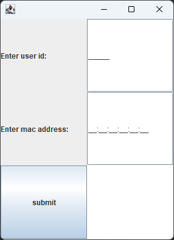

# Technische case Backend Developer NaaS

## Prerequisites:
JDK 21

Apache Maven 3.9.6

## Installation:

Run in desired directory:

> git clone https://github.com/RickyNJ/Techische_Case.git

## Building the project: 

> cd \Technische_Case

> mvn package 
 
## Run the application

> java -cp target\Technische_Case_Ricky_Nijsten-1.0-SNAPSHOT.jar Main

## Running the project in IDE:

Run: src\main\java\Main.java

## Usage:
1. Insert user id and mac address into the input fields.
2. Click the submit button.
3. The response will appear in the bottom right field.

